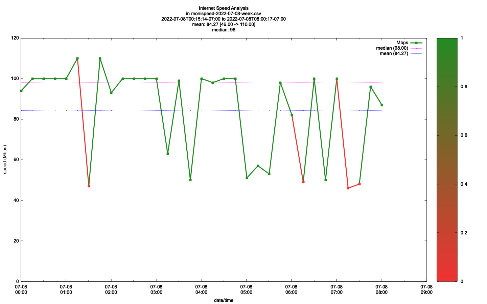

# monispeed - monitor internet connection speed

This project captures the speed of your internet connection over
time. It contains two tools: `monispeed.sh` and `plot-speed.gp`.

It was written because I suspected (and later confirmed) that my
internet speed did not match the speed that my ISP claimed.

The `monispeed.sh` _bash_ script collects data about the internet speed
and stores it in a CSV (comma separated variable) format file.  It wraps

The generated CSV data file can then be read by the `plot-speed.gp`
_gnuplot script_ to generate a simple plot that the shows the
speed over time.

The tools require _gnu date_, a recent version of _bash_ (5.x),
a recent version of _gnuplot_ (5.x) and recent version of _python_ (3.10).

> If you are interested in how i setup my mac please see the gist:
> [How i setup my Mac for development](https://gist.github.com/jlinoff/adb0a9b886085d9f3a4719571cfad901)

This is an example of a plot that was generated from an hours worth of
data collection.



As you an see, the plot changes color. It is red when the speed drops
below 50Mpbs otherwise it is green.

The example plot was generated by running `make week` and then
plotting a partial result later _while_ the make command was still
running: `./plot-speed.gp monispeed-2022-07-08-week.csv`

These tools can be used to monitor your interconnection to see how
fast it is. The data and plot can also be presented to your
internet service provider (ISP) to help track down service problems.

To check the reliability of your internect connection
check out [moniconn](https://github.com/jlinoff/moniconn).

### initial setup
This is not required because the setup is checked before each target is run.

```bash
make setup
```

### get an hourly report:

```bash
make hour
```

### get a daily report:

```bash
make day
```

### get a weekly report:

```bash
make weekly
```

### make help
```bash

=-=-=-=-=-=-=-=-=-=-=-=-=-=-=-=-=-=-=-=-=-=-=-=-=-=-=-=-=-=-=-=-=-=-=-=-=-=
=-=-= Target: help
=-=-= Date: Thu Jul  7 14:59:51 PDT 2022
=-=-= Directory: /Users/Joseph.Linoff/work/monispeed
=-=-=-=-=-=-=-=-=-=-=-=-=-=-=-=-=-=-=-=-=-=-=-=-=-=-=-=-=-=-=-=-=-=-=-=-=-=

Targets
   day          Make a daily report for the next full day and display plot when done.
   help         this help message
   hour         Make an hourly report starting at the beginning of the next hour and display plot when done.
   hour-now     Make an hourly report starting now and display plot when done.
   interval     Make a custom interval report. Must set START and STOP times. Example: make interval START=13:00 STOP=17:00
   month        Make a monthly report starting the next full day and display plot when done.
   setup        Setup the selenium python environment
   week         Make a weekly report starting the next full day and display plot when done.
```

### monispeed.sh environment variables
These environment variables control the behavior of monispeed.sh.
```
# Environment Variables
#   START=time    Start time, default: now.
#                 Set START='17:00' to start a 5:00pm
#                 Set START='23:59' to start a 11:59pm
#                 Set START='10 minutes' to start in 10 minutes.
#   STOP=cond     STOP condition. default: None (runs forever) or until ctrl-c is entered.
#                 Set STOP='1 minute' to stop after a minute.
#                 Set STOP='2 minutes' to stop after two minutes.
#                 Set STOP='1 day' to stop after a day.
#                 Set STOP='2 days' to stop after two days.
#                 Set STOP='1 week' to stop after a week.
#                 Set STOP='2 weeks' to stop after two weeks.
#   CSV           CSV data file, default (speed.csv)
#   GCB           Google chrome browser path,
#                 default: '/Applications/Google Chrome.app/Contents/MacOS/Google Chrome'
#   GCD           Google chrome driver path, default: wd/chromedriver
#   HEADLESS      Headless flag, default: 1 (true)
#   INTERVAL      Test interval, default: 15m (900s)
#   URL           The fast URL, default: https://fast.com
#   VERBOSE       Verbosity flag (1-report status, 2-show CSV record)
```

#### plot the results using gnuplot
```bash
gnuplot -p plot-speed.gp
```

#### plot the results using a different data file
```bash
./plot-speed.gp data.csv
```

#### plot the results to PNG file
```bash
./plot-speed.gp speed.csv speed.png
```
